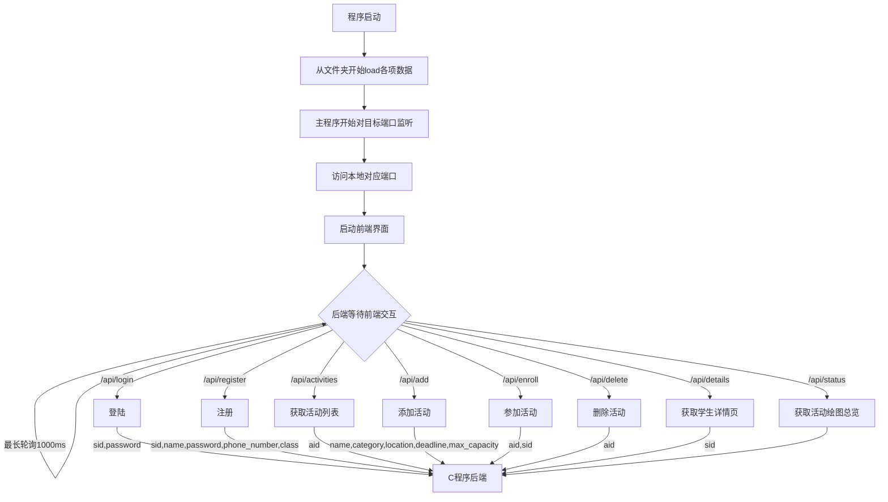

# 题目: 社团活动管理系统

## 要求:

- 用户登陆/注册功能
- 学生报名功能
- 管理员发布/删除活动功能
- 管理员查看报名清单功能
- 具有图形化界面

## 项目结构

```FILE
|
|-Data //数据存储文件夹
| |-activity.txt
| |-student.txt
| |-trash.txt
|-frontend //前端界面文件夹
| |-admin.html
| |-index.html
| |-student.html
|-main.c //核心逻辑处理
|-mongoose.c //mongoose网络库文件
|-mongoose.h //mongoose网络库文件
```

## 总体设计

利用mongoose库提供的网络通信功能,让C/Cpp程序和前端直接通过JSON通信,让我们的逻辑处理程序充当web中的后端服务器处理前端的POST请求,让图形界面模块和逻辑处理模块解耦合,缩短开发流程

## 详细设计

### 流程图



### 前端请求:

- 登陆(/api/login):发送POST内容{sID,password}
  - 返回成功:依据账号类型跳转至目标界面
  - 返回失败:警告框提示密码错误
- 注册(/api/register):发送POST内容{sID,name,password,phone_number,class}
  - 返回成功:返回登陆界面
  - 返回失败:警告框提示相应问题
- 获取活动列表(/api/activities):无POST内容
  - 接受返回字符串,根据JSON改写内部HTML,显示活动状态
- 发布新活动(/api/add):发送POST内容{name,category,location,deadline,max_capacity}
  - 返回成功:重新获取活动列表
  - 返回失败:警告框提示相应问题
- 报名参加活动(/api/enroll):发送POST内容{aID,sID}
  - 返回成功:重新获取活动列表
  - 返回失败:警告框提示相应问题
- 删除活动(/api/delete):发送POST内容{aID}
  - 重新获取活动列表
- 获取学生详情(/api/details):发送POST内容{sID}
  - 展开表格显示详情
- 获取活动总览(/api/status):无POST内容
  - 根据返回数据绘制饼状图

## 感悟总结

...